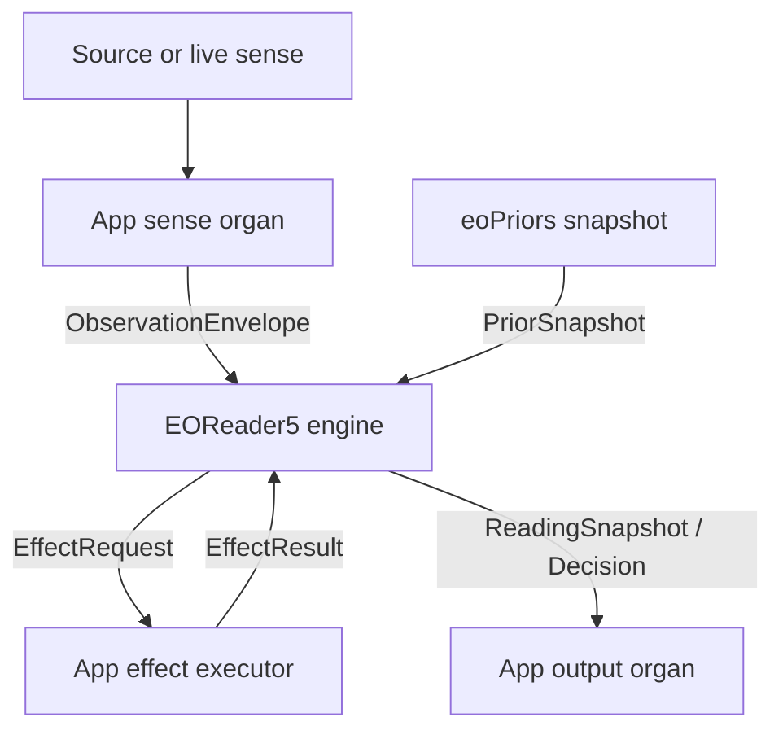
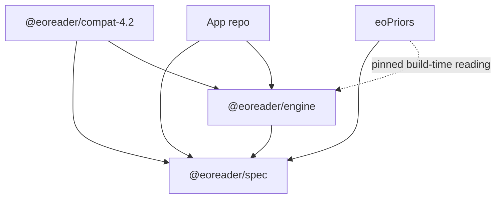

# EOReader5 consolidated architecture and migration plan

Status: canonical planning draft
Evidence snapshot: 2026-07-23
Source systems: eoreader4.2, eoPriors, the empty eoreader5 repository, and the planned app repository.

This document consolidates the two EOReader5 survival plans into one implementation handoff. It keeps the strict pure-engine boundary while incorporating the strongest continuity provisions from the broader migration plan: source custody, saved-modality preservation, EOT import, explicit 4.2 compatibility calls, contract freezing, and parity-gated stub retirement.

Normative terms are intentional:

- MUST is required for the architecture to count as EOReader5.
- SHOULD is the default unless measured evidence justifies an exception.
- MAY is optional and must not weaken a MUST.

## 1. Executive decision

EOReader5 is not a new full-stack EO Reader application. It is the pure semantic engine used by that application.

The app senses and acts. eoPriors publishes pinned priors. EOReader5 deterministically transforms explicit inputs into semantic events, readings, projections, and admissibility decisions.

The engine is a serializable fold:

```
(
  command,
  semantic-event DAG,
  prior snapshot,
  frame/lens,
  engine version
)
    ->
(
  new semantic events,
  projections,
  reading snapshots,
  enactment decisions,
  requested effects
)
```

EOReader5 MUST NOT:

- open files, URLs, microphones, cameras, databases, browser APIs, or network connections;
- contain a PDF, HTML, audio, MIDI, FASTA, image, table, or code decoder;
- select or call an embedding model, language model, search engine, or renderer;
- persist state to a filesystem, database, browser store, Matrix room, or remote service;
- create user-facing prose or other realized output;
- decide which prior is "current";
- call 4.2 or open a legacy route;
- derive ambient time or randomness;
- conceal meaningful state inside a callback, singleton, cache, or mutable registry.

The engine MAY validate, project, bind, score, abstain, qualify, veto, and emit a deterministic render plan. The app executes effects and renders results.

## 2. Repository responsibilities

### 2.1 EOReader5

EOReader5 owns:

- EO operator and cube semantics;
- canonical semantic-event schemas;
- append-only correction and supersession laws;
- referent identity and candidate equivalence;
- observation-to-meaning transformations;
- frame- and horizon-relative projections;
- provenance, authority, resolution, witness, and corpus-role rules;
- pure perception after modality normalization;
- surprise, significance, lens, fold, and navigation mathematics;
- grounding, fact-check, fabrication veto, and enactment decisions;
- deterministic replay and conformance.

### 2.2 The app repository

The app owns:

- all sense organs and modality adapters;
- source discovery, import, decoding, segmentation, and selector resolution;
- source custody storage, rights metadata, and resumable acquisition jobs;
- turns, workflows, cancellation, effect execution, and audit presentation;
- search, fetch, embedding, model, and tool calls;
- all persistence and synchronization adapters;
- all output organs and surface realization;
- reader, workspace, audit, research, chat, generation, wiki, coder, and other product UI;
- legacy 4.2 launch, context transfer, and artifact import;
- choosing a pinned prior and engine version for a session.

### 2.3 eoPriors

eoPriors owns:

- its append-only governance ledger;
- source and observation governance;
- exemplars, centroids, convention sets, seed corpora, and basis artifacts;
- measurement, compression, cross-validation, and emergence algorithms;
- candidate scoring and basis selection;
- human-gated basis, policy, projector, and compressor activation;
- discard, decline, correction, supersession, and provenance history;
- publishing immutable PriorSnapshot artifacts.

### 2.4 eoreader4.2

eoreader4.2 becomes:

- the frozen legacy product;
- a source of golden fixtures and parity behavior;
- an explicit compatibility target for unmigrated product capabilities;
- an archive of experiments and design history;
- never an upstream runtime dependency of the EOReader5 engine.

## 3. Canonical conceptual model

The engine MUST be organized around three stored semantic primitives:

- **Referent** — a locus of reference and continuity, not an entity assertion.
- **Observation** — what was detected and recorded.
- **Frame** — the stance and conditions under which an observation is interpreted or asserted.

Everything else is an event, projection, decision, or artifact derived from these.

### 3.1 A referent is not an entity or label

A referent may exist as a target of attention before the engine has earned a firm existence claim about it. A label, proper name, descriptor, pronoun, coordinate, or file identifier is a surface pointing toward a referent.

Therefore:

- labels MUST NOT be canonical identity;
- same-string surfaces MUST NOT automatically merge;
- different strings MUST be permitted to indicate one referent;
- `same_as?`, alias, merge, and split MUST be explicit provenance-bearing events;
- dark or unnamed referents MUST remain representable;
- a merge MUST preserve all prior surfaces and observations;
- identity MUST emerge from the event history, not from a mutable lookup table.

### 3.2 Observation, agent, provenance, and authority are distinct

Every meaning-bearing event MUST keep separate:

- observation — what was recorded;
- observing agent — who or what produced the observation;
- provenance — the prior observations, selectors, and transformations it depends on;
- authority — what permits the agent to assert a particular frame or commitment.

Provenance shows where a claim came from. Authority answers whether the actor was entitled to assert it. One cannot substitute for the other.

### 3.3 Given and Meant cannot collapse

The Given is append-only experiential substrate. The Meant is an explicit, frame-indexed interpretation.

The engine MUST enforce:

- the Given cannot be derived from the Meant;
- interpretation cannot manufacture a new observation;
- refinement cannot erase experience;
- a correction appends another observation or interpretation;
- interpretations remain defeasible, versioned, and provenance-bearing;
- text, graphs, tables, summaries, and dashboards are projections, not truth.

EO uses two semantic strata:

- Figure — experiential substrate and focal observation;
- Pattern — interpretive structure.

Ground may be used as a cube coordinate for prior/evidence conditions, but MUST NOT become a third mutable content stratum that can be filled with invented experience.

### 3.4 Frame and horizon

Meaning is frame- and horizon-relative. The same immutable event history may produce different honest projections under different: frames; lenses; prior snapshots; cursors; scopes; authorities; access horizons.

A horizon restricts availability. It MUST NOT create new substrate.

Every exported reading MUST identify the exact frame/lens, prior, semantic head, engine, and operator epoch used to produce it.

### 3.5 Uncertainty is not an operator

Uncertainty belongs in: resolution; posterior or score; candidate plurality; held/withheld state; measured nulls; conflict; provenance quality; calibration.

It MUST NOT become a tenth primitive act.

### 3.6 Absence, null, and refusal

Absence without provenance is merely silence. EOReader5 MUST distinguish: not observed; observed absence; unresolved; outside the horizon; withheld; contradicted; invalid under a frame; deliberately declined.

Void or withheld output is a valid result, not an error path. Definiteness MUST be earned.

## 4. Operator epoch: P0 decision

See `docs/operator-epoch.md` for the canonical decision, mapping table, and rationale.

## 5. Two ledgers, connected by an artifact

There are two append-only ledgers. They share integrity principles but not one schema.

### 5.1 EOReader semantic ledger

Records subject-matter acts: observations; referent admissions and candidates; NUL, SEG, DEF, SIG, CON, EVA, INS, SYN, and REC; provenance and authority; resolution; splits, merges, retractions, and supersessions; commitments and held decisions.

### 5.2 eoPriors governance ledger

Records the history of building and governing priors: source discovery and admission; observation representation; measurements; exemplar candidates and bases; policies, projectors, and compressor packs; human activation; corrections, decline, discard, and supersession.

### 5.3 The bridge

The ledgers meet through versioned immutable artifacts:

```
app sense organ
    -> ObservationEnvelope
EOReader5
    -> semantic events
    -> ReadingSnapshot
eoPriors
    -> representation/measurement events
    -> PriorSnapshot
app
    -> pins PriorSnapshot for a later EOReader5 run
```

This loop MUST use explicit content-addressed artifacts. It MUST NOT become: a runtime source import; a shared mutable database; a sibling-checkout assumption; an implicit "latest prior" query; a duplicated vendored engine.

## 6. Target dataflow and trust membrane



The app may execute an effect only because an app workflow chose to do so. An engine EffectRequest is a typed description, not ambient authority.

The app MUST return effect results as new input with: producer; version; configuration; source/custody information; provenance; relevant authority; content hash.

## 7. Proposed EOReader5 repository

```
eoreader5/
  packages/
    spec/
      schemas/
      operators/
      cube/
      contracts/
      canonical-json/
      versions/
    engine/
      ledger/
      observations/
      referents/
      frames/
      provenance/
      authority/
      resolution/
      projection/
      perceive/
      surf/
      fold/
      enact/
      effects/
      replay/
    compat-4.2/
      schemas/
      import/
      export/
      eot/
      fixtures/
    conformance/
      invariants/
      metamorphic/
      negative-controls/
      legacy-golden/
      fixtures/
  docs/
    architecture.md
    invariants.md
    event-model.md
    referents.md
    priors-boundary.md
    compatibility.md
    migration.md
```

### 7.1 Dependency direction



The engine package MUST have no runtime dependency on: the app; eoPriors implementation; compatibility code; a storage package; a model or embedding package; an organ package.

### 7.2 Contract manifests

Each engine package or holon SHOULD export its own contract manifest. An external assembler combines manifests for: tests; inspection; documentation; compatibility validation.

`core/contracts.js` MUST NOT be copied. A lower package cannot import more than 60 upper packages to discover their contracts.

`core/seams.js` MAY be retained temporarily as a migration ratchet, but the eoreader5 target is zero inward deep-import seams.

## 8. Public contracts

Public contracts MUST be JSON-schema-first and serializable. TypeScript types MAY be generated from the schemas, but TypeScript alone is not the wire contract. See `packages/spec/schemas/` for the canonical JSON Schema definitions of ObservationEnvelope, PriorSnapshot, SemanticEvent, ReadingSnapshot, CandidateSurface, EnactmentDecision, EffectRequest/EffectResult, and Legacy42Envelope.

## 9. Engine API

The initial API SHOULD be reducers and pure queries:

```
createState({ engineVersion, operatorEpoch, priorSnapshot })
applyCommand(state, command) // -> { state, events, projections, effects }
appendEvents(state, events)
replay(events, { priorSnapshot, frame, lens })
project(state, { frame, lens, cursor })
read(state, { frame, lens, cursor })
fold(readingSnapshot)
evaluate(state, candidateSurface) // -> EnactmentDecision
```

Mutable convenience wrappers MAY be added later. They MUST wrap these semantics rather than define alternative semantics.

## 10-26

See the full consolidated planning draft (subsystem disposition table, sense/output organ boundaries, prior boundary, source custody, EOT protocol, 4.2 compatibility layer, contract freeze, purity CI rules, conformance program, migration sequence, release gates, non-goals, work queue, and final architectural test) in the project history / task description this repository was seeded from. Sections 10-26 are normative and unchanged from that source; they are summarized operationally in `docs/migration.md`, `docs/compatibility.md`, `docs/invariants.md`, and `docs/priors-boundary.md`.
